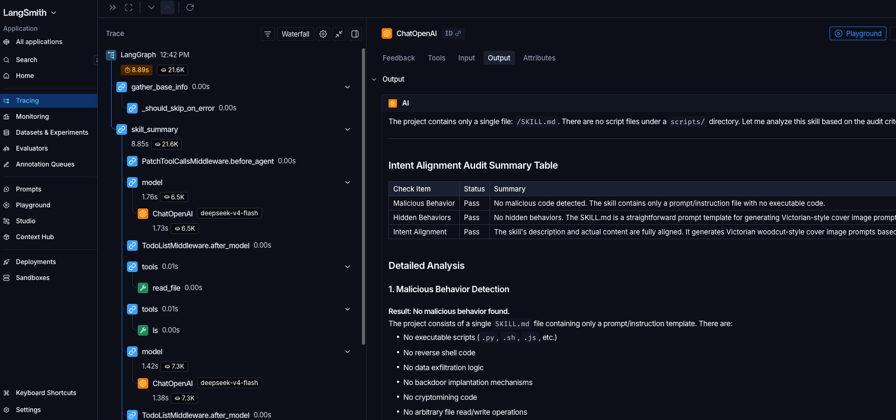

# Vetix

An LLM Agent-based SKILL security scanning tool for automated identification and assessment of security risks in SKILL directories.

[中文文档](./README_CN.md)

## Features

- Automatically parse SKILL directory structure and extract basic information
- Generate SKILL overview reports via LLM
- Detect script files and perform code security auditing
- Support English and Chinese report output
- LangSmith tracing integration
- Terminal report display + persistent file output

## Why Agent?

Traditional rule-based scanners rely on predefined patterns and signatures, which limits their ability to catch novel or subtle threats. Skill Scanner Agent leverages LLM-powered agents to overcome these limitations:

- **Beyond Rules** — Agents can understand code semantics and intent, detecting malicious behaviors that rule-based approaches miss (e.g., obfuscated code, multi-step attack chains, context-aware exploits).
- **Adaptive Reasoning** — Unlike static rules, agents dynamically reason about unfamiliar code patterns and adapt their analysis strategy based on what they discover during scanning.
- **Context-Aware Analysis** — Agents evaluate security risks in the broader context of the entire SKILL, recognizing subtle cross-file interactions and chained vulnerabilities that individual rules cannot capture.
- **Natural Language Explanations** — Every finding comes with a clear, human-readable explanation of the risk, impact, and recommended remediation — not just a rule ID.

## Workflow

1. **gather_base_info** — Validate SKILL directory, extract name, detect script files
2. **skill_summary** — Perform security overview analysis via LLM Agent
3. **audit_scripts** — Perform code security auditing via LLM Agent

## Quick Start

### Prerequisites

- Python >= 3.12
- [uv](https://docs.astral.sh/uv/) (recommended package manager)

### Installation

```bash
# Clone the repository
git clone git@github.com:HuTa0kj/vetix.git
cd vetix

# Install dependencies
uv sync
```

### Configuration

Copy the example config and fill in the required fields:

```bash
cp example.config.yaml config.yaml
```

Edit `config.yaml` to configure model API settings:

```yaml
models:
  - id: glm-5
    name: GLM-5
    api_key: ""
    base_url: ""
    temperature: 0.1

  - id: deepseek-v4-flash
    name: DeepSeek-V4-Flash
    api_key: ""
    base_url: ""
    temperature: 0.1
    extra_body: {"thinking": {"type": "disabled"}}

roles:
  skill_summary: deepseek-v4-flash
  audit_scripts: glm-5

limit:
  model_call: 80
  tool_call: 80

# langsmith config (Optional)
langsmith:
  tracing: true
  endpoint: "https://api.smith.langchain.com"
  api_key: ""
  project: ""

debug: false
output_dir: "./output"
language: "en"

```

**Configuration Reference:**

| Field | Description |
|-------|-------------|
| `models` | Available LLM models, each requires `id`, `api_key`, `base_url` |
| `roles` | Role-to-model mapping, supports assigning different models for different tasks |
| `langsmith` | LangSmith tracing config (optional) |
| `script_extensions` | Script file extensions to detect |
| `output_dir` | Report output directory |
| `language` | Report language, supports `en` (English) and `zh` (Chinese) |

### Usage

```bash
# Scan a SKILL directory
uv run vetix scan --source ~/.claude/skills/skill-directory
```

The target directory must contain a `SKILL.md` file.

### Output

After scanning, reports are saved to `output/<task_id>/`:

```
output/
└── <task_id>/
    ├── skill_summary.md    # SKILL overview report
    └── code_audit.md       # Code security audit report (only when scripts are present)
```

## Agent Tracing

After configuring your [LangSmith](https://smith.langchain.com/) key in config.yaml, you can track agents. You can see all the tool calls and details.



## Tech Stack

- **LangGraph** — Workflow orchestration
- **LangChain** — LLM invocation and message management
- **DeepAgents** — Agent construction
- **Typer** — CLI framework
- **Rich** — Terminal formatted output

## License

[MIT](LICENSE)
