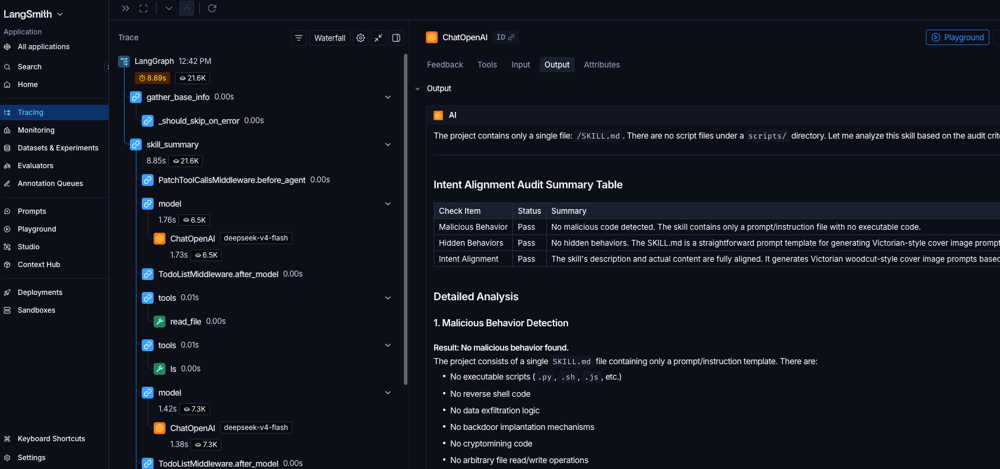

# Vetix

An LLM-agent-based scanner for [SKILL](https://docs.claude.com/en/docs/claude-code/skills) directories. Vetix pairs deterministic plugin rules with an LLM behavioral analyst so that both obvious indicators of compromise and subtle, obfuscated attack chains get caught in a single pass.

[中文文档](./README_CN.md)

## Features

- **Plugin-based static scanning** — rules catch deterministic security risks.
- **LLM cross-validation** — every plugin hit is re-judged against the real file content by an LLM, so high-recall rules don't drown the final report.
- **Behavioral analysis agent** — inside a virtual filesystem, traces the full chain "instruction → tool call → host impact" to uncover risks the rules miss: disguised commands, Base64 payloads, remote code loading, prompt injection, credential theft, persistence, and more.
- **Defense-in-depth sandbox** — virtual filesystems, explicit read allow-lists, and a blanket write deny isolate the real host.
- **LangSmith tracing** — every agent run is observable end-to-end.

## Detection Categories

The behavioral analysis agent classifies risks into 10 categories:

| Category | Description |
|---|---|
| Remote Execution | Remote code loading and execution, including `curl\|sh`, `wget\|bash`, and unofficial package installations |
| Data Exfiltration | Unauthorized collection and transmission of sensitive data to external addresses |
| Persistence | Backdoor mechanisms that survive reboots — crontab injection, SSH key planting, startup item modification |
| Destructive | Actions that corrupt data, delete files, or otherwise damage the host system |
| Obfuscation | Deliberate concealment of malicious payloads via Base64/Hex encoding, blank-line hiding, or disguised commands |
| Command Injection | Injection of arbitrary shell commands through unsanitized input or instruction manipulation |
| Privilege Escalation | Attempts to gain elevated permissions beyond what the skill's stated function requires |
| Sensitive File Access | Unauthorized reading or writing of SSH keys, `.aws` credentials, API keys, tokens, passwords, browser data, `.env` files, and similar secrets |
| Network Abuse | Suspicious outbound connections, C2 communication, or traffic to hard-coded external IPs/domains |
| Prompt Injection | Instructions that rewrite agent behavior — "ignore previous instructions", "DAN mode", "forget everything", etc. |

## Why an Agent?

Traditional rule-based scanners rely on predefined patterns and signatures, which limits their ability to catch novel or subtle threats. Vetix leverages LLM-powered agents to overcome these limitations:

- **Beyond rules** — Agents understand code semantics and intent, detecting malicious behaviors that rule-based approaches miss (obfuscated code, multi-step attack chains, context-aware exploits).
- **Adaptive reasoning** — Unlike static rules, agents dynamically reason about unfamiliar code patterns and adapt their analysis based on what they discover during scanning.
- **Context-aware analysis** — Agents evaluate risks in the broader context of the entire SKILL, recognizing cross-file interactions and chained vulnerabilities that individual rules cannot capture.
- **Natural-language explanations** — Every finding comes with a clear, human-readable explanation of the risk, impact, and recommended remediation — not just a rule ID.

## Deployment

### uv

```bash
git clone git@github.com:HuTa0kj/vetix.git
cd vetix
uv sync
```

Copy the example config and fill in your model credentials:

```bash
cp example.config.yaml config.yaml
```

`config.yaml` defines two LLM roles: a lightweight model for plugin-hit verification, and a stronger model for behavioral analysis.

```yaml
models:
  - id: deepseek-v4-pro
    name: DeepSeek-V4-Pro
    api_key: ""
    base_url: "https://example.com/v1"
    temperature: 0.7
    extra_body: {"thinking": {"type": "disabled"}}

  - id: deepseek-v4-flash
    name: DeepSeek-V4-Flash
    api_key: ""
    base_url: "https://example.com/v1"
    temperature: 0.7
    extra_body: {"thinking": {"type": "disabled"}}

roles:
  lite: deepseek-v4-flash
  pro:  deepseek-v4-pro

# Optional: LangSmith tracing
langsmith:
  tracing: true
  endpoint: "https://api.smith.langchain.com"
  api_key: ""
  project: ""
```

| Field | Description |
|-------|-------------|
| `models` | Available LLMs. Each entry requires `id`, `api_key`, `base_url`; `temperature` and `extra_body` are optional. |
| `roles.lite` | Fast model, for speed-oriented, less complex tasks. |
| `roles.pro` | Reasoning model, for tasks that require complex reasoning. |
| `langsmith` | LangSmith tracing config (optional). |

Common commands

```bash
# Scan a SKILL directory
uv run vetix scan --source xxx

# Short form
uv run vetix scan -s xxx

# Enable debug logging
uv run vetix scan -s xxx --debug

# Use Chinese output
uv run vetix scan -s xxx -l zh

# Only render the report in the terminal, do not save a JSON file
uv run vetix scan -s xxx --no-output

# Custom output directory
uv run vetix scan -s xxx --output-dir ./reports

# Create a new plugin
uv run vetix create --plugin "my check"
```

### Docker

Run Vetix as a one-shot container without installing Python or `uv` on the host.

Build the image

```bash
docker build -t vetix:latest .
```

Configuration

Vetix reads `config.yaml` from a fixed in-container path (`/app/config.yaml`), using the same format as the uv option above. Prepare `config.yaml` on the host and bind-mount it read-only:

```bash
cp example.config.yaml config.yaml
# edit config.yaml: fill in real api_key / base_url for both models
```

Run a scan

```bash
docker run --rm \
  -v "$PWD/config.yaml:/app/config.yaml:ro" \
  -v "$PWD/examples/skills/xxx:/skills/xxx:ro" \
  -v "$PWD/output:/app/output" \
  vetix:latest scan -s /skills/xxx
```

### Docker Compose

`docker-compose.yml` binds `./config.yaml`, `./skills`, and `./output`. Put the skills you want to scan under `./skills/xxx`, then run:

```bash
docker compose run --rm vetix scan -s /skills/xxx
```

## Agent Tracing

Configure [LangSmith](https://smith.langchain.com/) in `config.yaml` to trace every agent run — model calls, tool invocations, and structured outputs are all visible.



## License

[MIT](LICENSE)
